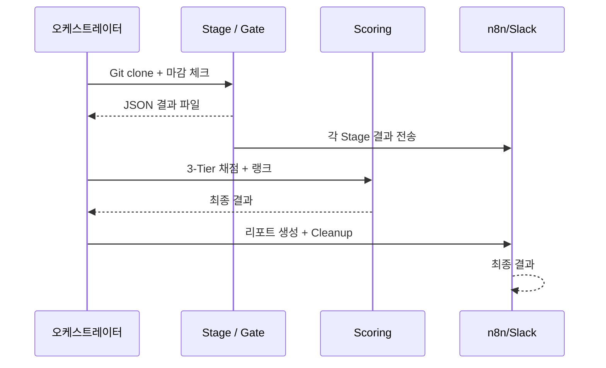
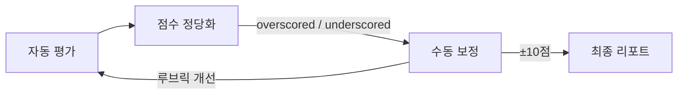
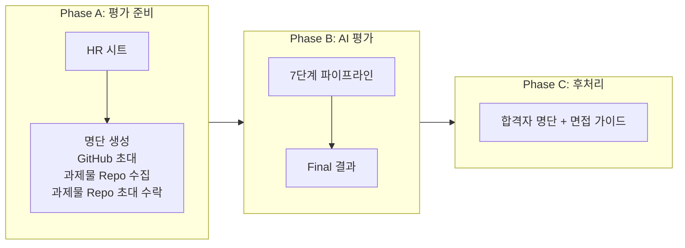

> 🇺🇸 [Read in English](/posts/2026-04-14-ai-native-hiring-part2-the-machine/)

AI 네이티브 채용 시리즈 3부작 중 Part 2입니다. Part 1: [철학, 루브릭, 3-Tier 평가 모델](/posts/2026-02-24-ai-native-hiring-philosophy.ko/) · Part 3: [사람을 보는 30분 — 점수 너머의 판단](/posts/2026-04-14-ai-native-hiring-part3-the-human.ko/)

[이명훈](https://medium.com/@mh.lee_16701)(무신사 Core Engineering) 작성, Tao Kim 편집.

> 📌 [무신사 테크블로그 원문](https://techblog.musinsa.com/the-machine-ai%EA%B0%80-ai-%ED%99%9C%EC%9A%A9-%EC%BD%94%EB%93%9C%EB%A5%BC-%ED%8F%89%EA%B0%80%ED%95%98%EB%8B%A4-c2345aab5b7a)

Part 1에서 철학을 이야기했습니다. 모호함이 곧 테스트이고, 정답에 도달한 사람이 아니라 질문을 이해한 사람을 찾는다는 이야기. 3-Tier 평가 모델도 소개했습니다. **Make it Work**, **Basic Features**, **Deep Thought**.

그 철학을 실행에 옮기려면, 400여 명의 코드를 실제로 읽고, 빌드하고, 테스트하고, 점수를 매기고, 등급을 분류해야 합니다. 한 명에 2시간이면 800시간. 한 사람이 주 40시간 일해도 5개월입니다.

**이 글은 그 머신을 만들고, 돌리고, 반복하며 고도화한 이야기입니다.** 에이전트의 능력이 향할 방향을 잡아주는 하네스를 설계하고, 실행 결과를 보며 그 하네스를 계속 조여온 이야기입니다.

과제는 대학교 수강신청 시스템입니다. 겉보기엔 CRUD 앱이지만, "정원이 1명 남은 강좌에 100명이 동시에 신청하면 정확히 1명만 성공해야 한다"는 요구사항이 난이도를 올립니다. AI 코딩 에이전트를 활용하여 구현하는 것이 전제이고, 코드뿐 아니라 AI와의 협업 과정도 평가 대상입니다.

> 후보자들에게 충분한 토큰과 Codex를 지원해준 OpenAI 팀, 다시 한번 감사드려요!


---

# Chapter 1: 머신을 만들다

## 멀티 에이전트라는 선택

### 코딩 어시스턴트가 아니라 프로세스 실행자

한 명의 과제를 평가하는 데 필요한 동작을 나열하면:

1. Git clone → 커밋 마감 체크 → 마감 이전 커밋으로 checkout
2. 소스코드 보안 스캔
3. 프로젝트 형식 검증
4. 코드 전체를 읽고 8개 영역에서 채점 (AI 판단)
5. Docker 빌드 → 서버 기동 → 테스트 케이스 실행
6. 3-Tier 모델로 점수 계산 → 랭크 결정
7. 상태 업데이트 → Slack 알림 → Docker 정리 → 결과 저장

이것을 400여 명에 걸쳐 반복합니다.

4번만 빼면 AI가 필요 없는 것처럼 보입니다. 그런데 반대입니다. 4번을 AI가 하는 건 당연하고, 나머지 6개를 AI가 자율적으로 실행하는 것이 진짜 요구사항입니다.

첫 번째 선택지는 당연히 "직접 만들자"였습니다. Python이나 TypeScript로 평가 파이프라인을 처음부터 작성하는 길. 전담 인원은 제한적이었고, 채용 일정은 기다려주지 않았습니다. Git clone, 보안 스캔, Docker 빌드, API 테스트, 점수 계산, 외부 시스템 연동까지 모두 로우레벨부터 작성하고 검증하는 것 자체가 하나의 큰 프로젝트입니다.

터미널 기반 AI 에이전트는 그 자체로 범용 실행자입니다. 코드를 읽고 판단하는 것은 물론, 터미널 명령 실행, 파일 시스템 조작, Docker 제어까지 이미 수행합니다. Cursor나 GitHub Copilot 같은 코딩 어시스턴트는 코드를 읽고 판단하는 것은 가능하지만, Docker 빌드, 포트 관리, 쉘 스크립트 실행, 외부 API 호출을 자율적으로 수행하지는 못합니다. 코딩 어시스턴트가 아니라 범용 에이전트가 필요했습니다.

직접 코드를 작성하는 대신, 이미 이 모든 것을 할 수 있는 에이전트에게 "무엇을 해야 하는지"만 알려주면 됩니다. 에이전트는 능력을 제공하고, 우리는 그 능력이 향할 방향을 설계합니다. 개발해야 할 것은 에이전트 자체가 아니라 에이전트를 제어할 하네스였습니다. 에이전트가 따를 지침서, 점수를 매길 루브릭, 결과를 담을 출력 스키마가 그 구성 요소입니다.

---

## 프롬프트에서 지침서로

"이 코드를 평가해줘." 이렇게 던져줄 수 있습니다. AI는 평가하고, 결과를 돌려줍니다. 다음 사람? 처음부터 다시. 매번 기준이 미묘하게 달라지고, 출력 형식도 달라지고, 평가 깊이도 들쭉날쭉합니다. 1명은 이렇게 해도 됩니다. 400여 명은 안 됩니다.

그렇다면 프롬프트 하나를 지침서로 바꾸면 해결될까요? 절반은 맞습니다. 기존 LLM 활용 방식과의 가장 큰 차이는 **재현성**입니다. 같은 지침 파일을 읽으므로 400여 명이 동일한 기준으로 채점됩니다. 결과는 JSON Schema로 강제된 구조를 따르고, 파일과 DB에 영속됩니다.

더 결정적인 문제가 남아 있습니다. **멀티 에이전트 아키텍처**. 한 에이전트가 400여 명을 순차적으로 채점하면 어떻게 될까요? 컨텍스트 오염이 발생합니다. 49번째 사람의 코드를 기억한 채 50번째를 채점합니다. 사람도 하는 실수를 AI도 합니다. 해결책은 후보자별로 독립 에이전트를 생성하고, 각 에이전트가 깨끗한 컨텍스트에서 평가를 수행하는 방식입니다.

오케스트레이터 에이전트가 후보자 목록을 순회하며, 후보자마다 새로운 서브 에이전트를 생성합니다. 칸막이가 있는 시험장을 떠올리면 됩니다. 각 에이전트가 독립된 채점실에서 작업합니다. 서브 에이전트는 자신만의 깨끗한 컨텍스트 안에서 평가를 수행하고, 결과를 반환하고, 사라집니다. 컨텍스트 격리와 평가 격리가 동시에 달성됩니다.

---

## 7단계 파이프라인

한 명의 평가는 7개 단계를 거칩니다. 파이프라인으로 들어가기 전, 제출 과정이 먼저 있습니다. 지원자가 자신의 GitHub에 private 레포를 만들고 무신사 평가 계정을 collaborator로 초대하면, 초대 수락과 레포 상태 확인이 자동으로 처리되고 레포 URL이 DB에 기록됩니다. 여기까지가 평가의 입력입니다.

단계는 두 종류로 나뉩니다. 준비와 집계, 출력을 담당하는 **Stage**, 그리고 후보자를 걸러내는 기준이 되는 **Gate**. 이 파이프라인의 목적 자체가 스크리닝이라서, 실제 걸러냄이 일어나는 4개 지점에 Gate라는 이름을 붙였습니다.



**Init Stage**는 등록된 레포를 clone하고, 마감 이전 마지막 커밋으로 checkout해 그 시점의 코드를 스냅샷으로 고정합니다. 커밋 타임스탬프는 지원자가 조작할 수 있기 때문에, 마감 판정은 GitHub에 실제로 push된 시각(서버 타임스탬프)을 함께 확인합니다. 마감 이전 push가 없으면 실격입니다.

**Security Gate**는 보안 스캔입니다. OS 명령 실행, 네트워크 요청, 시크릿 하드코딩 탐지. 평가 환경의 안전을 지키는 첫 번째 관문으로, 여기서 걸리면 통과하지 못합니다.

**Preflight Gate**는 평가 전 점검입니다. README가 있는가, 소스 디렉토리가 있는가, 빌드 설정 파일이 유효한가. "평가 가능한 프로젝트인가?"를 판단하고, 아니면 여기서 멈춥니다.

**Quality Gate**는 AI가 코드를 읽고 8개 영역에서 사고의 깊이를 채점합니다.

**Functional Gate**는 Docker 컨테이너에서 실제로 서버를 기동하고, 테스트 케이스를 실행해 기능을 검증합니다.

**Scoring Stage**에서 이 두 축을 합산해 3-Tier 모델로 최종 점수를 계산하고, 7단계 랭크를 결정합니다.

**Report Stage**에서 대시보드 업데이트, Slack 알림, Docker 정리까지 마무리합니다.

핵심은 각 단계가 두 가지 일을 동시에 한다는 점입니다. 로컬에 결과 JSON 파일을 생성하고(재실행의 기반), 동시에 외부 상태를 업데이트합니다(대시보드와 통계의 기반). 이 이중 기록 덕분에, 채점 모델이 바뀌어도 단계별 원본 결과는 그대로 보존하고 최종 리포트만 재생성하면 됩니다. 이 설계 덕분에 여러 번 초기화가 가능했습니다.

---

## Markdown as Code

이 파이프라인은 마크다운으로 구현되어 있습니다.

마크다운으로 프로그램을 만든다고요? 비유가 아닙니다. 문자 그대로입니다. "어떻게 Docker를 빌드하고, 어떤 순서로 TC를 실행하고, 점수를 어떻게 매기는지"가 마크다운 파일에 정의되어 있습니다. AI 에이전트가 이 문서를 읽고 그대로 실행합니다. 마크다운이 곧 프로그램입니다.

각 단계의 지침서는 독립적입니다. Quality Gate만 재실행하거나, Scoring Stage만 다시 계산할 수도 있습니다. 내용이 바뀌면 해당 지침서만 수정하고 Git push하면 끝입니다. 코드 컴파일도, 배포도 필요 없습니다.

하네스를 빠르게 고칠 수 있어야 했습니다. 응시자들의 역량이 예상보다 높았고, 변별력 확보를 위해 평가 항목을 더 상세화해야 했습니다. 매번 코드를 수정하고 테스트하고 배포할 여유가 없었습니다. 마크다운 지침서는 수정 즉시 반영됩니다.

평가 결과를 보고 루브릭을 고치고 다시 돌리는 사이클이 빨라야 했습니다. 최근 '하네스 엔지니어링'이라 불리기 시작한 접근입니다. 에이전트를 만드는 것이 아니라, 에이전트가 따를 지침을 설계하고 반복적으로 조율하는 작업. 코드를 고치지 않습니다. 하네스를 수정하면 코드가 다시 만들어집니다. 마크다운이 그 속도를 가능하게 했습니다.

마크다운의 유연함에는 대가가 있습니다. AI의 출력이 기대한 형식을 따르지 않는 문제입니다. 7개의 JSON Schema가 모든 단계의 출력에 구조적 계약을 강제합니다. strict 모드(additionalProperties: false)로 검증하고, 실패하면 에러를 AI에게 돌려보내 수정하게 하는 루프를 최대 5회 반복합니다. 마크다운의 자유도와 JSON Schema의 엄격함. 이 조합이 하네스의 골격입니다.

---

## 깊은 사고를 측정하는 Quality Gate

3시간짜리 과제입니다. 기본 요구사항은 수강신청 CRUD와 동시성 제어. 그런데 제출물을 열어보면, 멀티레이어 캐싱(L1 로컬 + L2 Redis)을 구현한 사람, JWT 인증과 RBAC를 붙인 사람, 분산 트레이싱(OpenTelemetry)이나 DDD 전술 패턴까지 나아간 사람도 있습니다. 한두 명이 아닙니다. AI 코딩 에이전트의 구현 파워가 이 수준입니다.

이것이 평가를 어렵게 만듭니다. "수강신청을 구현했는가"는 대부분이 통과합니다. 변별력은 그 너머에 있습니다. AI가 만들어낸 코드의 양이 방대할수록, 이 사람이 이해하고 만든 것인지 AI가 만든 것을 그대로 제출한 것인지 구별하기가 더 어려워집니다.

결과물이 동작하면 충분한 것 아닐까요? AI 에이전트가 잘 만들어줄 테니, 빌드되고 테스트를 통과하면 그걸로 된 것 아닐까요?

코드만 본다면 그렇습니다. 우리가 채용하는 건 코드가 아니라 사람입니다. 동작하는 코드 뒤에 있는 사고가 깊은지 얕은지, AI에게 맡기기만 한 건지 이해하면서 쓴 건지. 이걸 구별하려면 결과물 너머를 봐야 합니다. Quality Gate가 이것을 실행합니다.

AI가 후보자의 코드, 문서, 프롬프트를 전부 읽고 8개 영역에서 품질을 채점합니다. 이 과제는 AI 코딩 에이전트를 활용하여 구현하는 것이 전제이므로, 코드 품질뿐 아니라 AI를 어떻게 활용했는가도 평가 대상입니다.

| 영역 | 배점 | 평가 대상 |
|------|------|-----------|
| 프롬프트 | 18 | AI와의 협업 사고 과정 — 통찰의 깊이, 모호성 탐색, 토론 품질 |
| 에이전트 지침 | 17 | AI에게 프로젝트 맥락을 얼마나 잘 전달했는가 |
| 요구사항 도출 | 18 | 과제 요구사항을 자기 언어로 재구조화했는가 |
| 데이터 설계 | 17 | ERD, 정규화, 인덱스 전략 |
| 코드 품질 | 19 | 아키텍처, 동시성 제어, 에러 처리 |
| 테스트 | 10 | 테스트 커버리지, 동시성 테스트 포함 여부 |
| Git 이력 | 5 | 의미 있는 커밋 단위로 작업했는가 |
| 추가 구현 | 10 | 캐싱, 모니터링, API 문서화 등 기본 요구사항 이상의 구현 |

프롬프트와 에이전트 지침, 합산 35점. 이 두 영역은 기존 코딩 테스트에는 없는 항목입니다. 기존 코드 리뷰는 엔지니어가 도구와 어떻게 소통했는지 보지 않습니다. 그런데 그 도구가 AI 에이전트일 때, 소통의 품질은 엔지니어링의 일부입니다. AI에게 무엇을 시켰는가가 AI가 무엇을 만들었는가만큼 중요합니다.

이것이 초기 배점입니다. 이 배점이 실전에서 어떻게 바뀌는지는 Chapter 2에서 다룹니다.

### 근거 없는 점수는 점수가 아니다

AI가 채점할 때는 반드시 코드 증거(파일:라인)를 제시해야 합니다. "에러 처리가 잘 되어 있다"는 점수가 아닙니다. "src/handler/GlobalExceptionHandler.java:15에 @ControllerAdvice 기반 전역 예외 처리 구현", 이것이 점수입니다.

처음부터 이 원칙은 있었습니다. 원칙과 실행 사이에는 간극이 있었습니다. 본평가 전에 내부 엔지니어들이 동일한 과제를 직접 풀어주었고(갑작스러운 소환에 응해준 동료들에게 이 자리를 빌려 감사를 전합니다), 그 제출물로 파이프라인을 검증했습니다. 사내 테스트에서는 잘 동작하던 루브릭이, 실제 400여 명의 다양한 코드를 만나자 AI가 "잘 되어 있다"고만 쓰고 근거를 생략하는 패턴이 나타났습니다. 근거가 없으면 검증할 수 없습니다. 검증할 수 없으면 신뢰할 수 없습니다.

루브릭을 강화했습니다. 이미 수백 명분의 결과가 있는 상태에서 채점 항목을 더 정밀하게 다듬었고, 신뢰성을 위해 결과를 초기화하고 처음부터 다시 돌렸습니다.

---

## 기능 테스트의 실전 — Functional Gate

Quality Gate를 먼저 설명한 이유가 있습니다. 코드를 읽고 채점하는 것은 상대적으로 빠르고 단순합니다. 반면 실제로 코드를 실행하는 것, 즉 Docker 컨테이너를 띄우고 서버를 기동하고 테스트 케이스를 돌리는 작업은 결과가 단순해 보이지만 훨씬 어려운 문제입니다. Functional Gate는 그 어려운 쪽을 담당합니다. 이 코드가 실제로 동작하는지를 확인합니다.

프로그래밍에서 Duck Typing이라는 개념이 있습니다. 오리처럼 걷고 오리처럼 꽥꽥대면, 오리라고 본다. Functional Gate도 같은 원리입니다. 동작하는 시스템처럼 응답하면, 동작하는 시스템으로 인정합니다. 어떻게 거기 도달했는지는 묻지 않습니다.

### 후보자마다 API가 다르다

여기서 가장 어려운 점은 후보자마다 API 엔드포인트가 다르다는 점입니다.

우리는 의도적으로 API 엔드포인트를 지정하지 않았습니다. "오픈소스처럼 문서화하라"고 했을 뿐입니다. Part 1에서 말한 "모호함이 곧 테스트"의 실행입니다. 다만 완벽한 모호함은 평가도 불가능하게 만듭니다. 수백 명의 제출물을 자동으로 평가하려면 어느 정도의 공통 구조가 필요했고, 오픈소스 문서화 관행(README, API 스펙)이 그 최소한의 힌트였습니다. 그 결정이 낳은 기술 결과는 이렇습니다.

- 후보자 A: `POST /enrollments`, body에 studentId/courseId
- 후보자 B: `POST /api/v1/enrollments`, body에 student_id/course_id
- 후보자 C: `POST /courses/{id}/enroll`, 헤더 X-Student-Id

같은 "수강신청" 기능이 수십 가지 형태로 구현되어 있습니다. 고정된 엔드포인트에 요청을 보내는 전통적인 자동화 테스트는 불가능합니다.

AI 에이전트가 후보자의 문서와 소스코드를 읽고, 기능별로 실제 엔드포인트를 매핑합니다. 정적 분석으로 프레임워크별 패턴을 탐색하고(@PostMapping, app.post(), @app.post()), Docker 컨테이너가 기동되면 탐지된 엔드포인트에 실제 요청을 보내 동작 여부를 확인하고, 검증된 엔드포인트를 각 테스트 케이스에 매핑합니다.

엔드포인트를 지정하지 않았기 때문에 탐지가 필요합니다. 문서를 잘 쓴 후보자의 코드는 빠르게 매핑됩니다. 그렇지 않은 경우에는 프레임워크 패턴, 소스코드 구조, 빌드 설정까지 추가로 확인해야 합니다. 자기 코드를 실행할 사람에게 충분한 문맥을 제공하는 것(AI가 읽든 사람이 읽든)은 좋은 엔지니어의 습관입니다. **좋은 문서가 곧 테스트 가능성입니다.** (문서가 부실하면 에이전트가 토큰을 더 씁니다. 감점 사유로 넣을까 잠깐 고민했습니다.)

### 단계별 부분 점수

테스트 케이스는 단순한 Pass/Fail이 아닙니다. 하나의 TC 안에서 구현 수준에 따라 정수 점수를 차등 부여합니다.

동시성 테스트를 예로 들면, 50개의 동시 요청을 보내서 정확히 1명만 성공하는지를 3회 반복 확인합니다. 3회 모두 정확하면 10점, 2회 정확하면 8점, 1회 정확하면 6점, 정원 초과는 없지만 정확도가 부족하면 4점, 일부 시도에서 정원 초과가 발생하면 2점, 동시성 제어 자체가 없으면 0점.

"거의 됐는데 가끔 실패한다"도 부분 점수를 받습니다. 동시성을 3번 중 2번만 정확하게 처리하는 사람과 동시성 제어가 전혀 없는 사람은 다른 이야기입니다.


### 빌드가 실패해도 이야기는 끝나지 않는다

빌드가 실패하면 대부분의 TC가 실행 불가능합니다. 그래도 "왜 실패했는가"가 중요합니다. "npm 버전이 안 맞아서 빌드 실패"와 "코드가 아예 없어서 빌드 실패"는 전혀 다른 이야기입니다. 전자는 환경만 맞추면 동작할 가능성이 높습니다. 빌드 실패율 약 15%를 낮추기 위해 15개의 Dockerfile 템플릿을 준비했습니다. Java(Gradle/Maven), Node.js(npm/yarn), Python(pip/poetry)의 다양한 조합에 대응하되, 후보자의 소스코드는 한 줄도 건드리지 않습니다. Docker 인프라만 수정 허용, 소스코드 수정 금지.

### 빌드는 되는데 실행이 안 되는 경우

Dockerization은 의도적으로 강제하지 않았습니다. 실행 환경까지 고려해서 테스트 용이성을 고민한 후보자에게 더 높은 점수를 주려는 의도입니다.

그런데 이 결정이 흥미로운 문제를 만들었습니다. 아무런 명시 없이 MySQL 5.x를 가정한 후보자들이 있었습니다. 평가 에이전트는 많은 경우 MySQL 8로 연동해서 컨테이너를 구성했고, 빌드는 되지만 실행에서 실패했습니다. 특정 쿼리 패턴을 지원하지 않는다거나, 기본 설정이 달라서 연결 자체가 안 되는 식입니다.

사고의 깊이가 보이는 후보자를 환경 불일치로 탈락시키는 것이 맞는가? 개별 건을 검토하고, 소스코드를 고치지 않는 선에서 실행 환경에 힌트를 주는 방식으로 구제했습니다. 명시하지 않았기 때문에 생기는 복잡도입니다.

그리고 빌드나 실행이 실패해도 Quality Gate(AI 코드 리뷰)는 여전히 수행됩니다. 코드를 실행할 수 없다고 코드를 읽을 수 없는 것은 아닙니다. 기능은 검증할 수 없지만, 사고의 깊이는 여전히 측정합니다.

---

## 채점 모델의 진화

### Pass/Fail에서 3-Tier로

채점 모델은 사전에 설계한 뒤 사내 테스트로 검증하고 시작했습니다. 그런데 실제 400여 명의 제출물은 사내 테스트와 달랐습니다. 실행 결과를 보고, 문제를 발견하고, 모델을 고치고, 다시 돌리는 반복을 거쳤습니다. 보상 함수 튜닝에 가까운 과정이었습니다.

처음에는 단순했습니다. **Pass/Fail 시대.** TC를 돌려서 통과하면 pass, 실패하면 fail. 한계는 금방 드러났습니다. 동시성까지 완벽하게 처리하는 사람과 기본 CRUD만 겨우 통과한 사람이 같은 pass라니. 이건 아닙니다.

그래서 **등급제**로 넘어갔습니다. 점수 구간을 나눠 S/A/B/C/D/F 등급을 부여했습니다. 나아졌지만, 또 다른 문제가 생겼습니다. 평가 항목을 정밀화할 때마다 등급이 요동쳤습니다. 기능 점수와 코드 품질 점수를 단순 합산하면, "기능은 부족하지만 코드 설계가 뛰어난 사람"과 "기능은 완벽하지만 코드가 엉성한 사람"이 같은 등급에 묶였습니다.

마침내 **3-Tier 모델**에 도달했습니다. 여기서 핵심 분리가 일어났습니다. 기능 작동과 깊은 사고를 독립적으로 평가하는 방식.

Base는 Functional Gate에서 나옵니다. Docker 컨테이너에서 TC를 실행해서 매기는 기능 점수. 코드가 동작하는가? Depth는 Quality Gate에서 나옵니다. AI가 코드와 문서를 읽고 8개 영역에서 매기는 점수. 코드를 이해하고 있는가? 이 둘은 서로 독립적으로 채점됩니다.

왜 이렇게까지 분리해야 했을까요? 빌드 실패(Base=0)인데 코드 설계가 탁월한 사람이 있었습니다. 반대로 기능은 완벽한데, 코드를 들여다보면 AI가 생성한 코드를 얕게 이해한 채 제출한 사람도 있었습니다. 이 둘을 같은 잣대로 재면 어느 쪽도 제대로 평가하지 못합니다. **기능과 깊이를 분리한 이유가 여기에 있습니다.**

### 7단계 랭크

Base와 Depth를 합산하면 총점이 나옵니다. 총점 순으로 줄 세우면 간단합니다. 그런데 같은 총점이라도 Base가 높고 Depth가 낮은 사람과, Base가 낮고 Depth가 높은 사람은 전혀 다른 후보자입니다. 점수의 크기가 아니라 점수의 패턴이 채용 시그널이었습니다. 다른 패턴은 다르게 봐야 합니다.


**Ace**는 기능 점수와 코드 품질 모두 높은 수준을 달성한 경우입니다.

**Craftsman**은 기능은 Ace와 동일하게 높지만, 코드 품질은 중간 이상이면 충분합니다.

**Hustler**가 가장 흥미로운 랭크입니다. 기능은 완벽하게 동작합니다. 모든 TC를 통과합니다. 하지만 Depth 점수가 낮습니다. 여기서 판단이 어려워집니다. 요구사항을 완벽하게 구현하기 위해 깊이 사고한 결과일 수도 있고, AI가 만들어준 코드가 운 좋게 잘 돌아간 것일 수도 있습니다. 머신은 이 패턴을 탐지하지만, 어느 쪽인지는 구분하지 못합니다. 이 랭크에서 면접 결과가 가장 극적으로 갈렸습니다.

**Thinker**는 반대 방향입니다. 빌드에 실패했지만 코드 품질이 기준을 넘습니다. DevOps 경험이 부족할 뿐 사고력이 뛰어난 개발자. "빌드만 안 되고 나머지는 다 좋은 사람"을 0점 처리하는 것이 맞는가? 이 고민에서 태어난 랭크입니다.

Hustler와 Thinker. 기능은 완벽하지만 사고가 얕은 사람과, 실행은 삐끗했지만 사고가 깊은 사람. 이 둘을 구별하는 것이 Base와 Depth를 분리한 진짜 이유입니다.

**Contender**는 기능 점수가 중상위권입니다. **Rookie**는 기능 점수가 중위권입니다. 추가 검증을 거쳐야 합니다. **Incomplete**는 그 외 모든 경우로, 기준 미달입니다.

---

7단계 파이프라인, 3-Tier 채점, 7개 랭크. 여기까지가 하네스의 설계입니다.

설계만으로는 부족합니다. 하네스는 돌려봐야 알 수 있습니다. 실행 결과가 루브릭을 고치고, 고쳐진 루브릭이 다음 실행을 바꿉니다. AI 채점은 빙산의 일각이고, 그 아래에는 이 반복의 무게가 있습니다.

---

# Chapter 2: 머신을 돌리다

## 루브릭의 진화

Chapter 1에서 초기 배점을 보여드렸습니다. 8개 영역에 10-19점을 비교적 균등하게 분배했습니다. 짧은 사내 테스트에서는 나쁘지 않았습니다.

실제 400여 명을 돌리자 그림이 달라졌습니다.

예상보다 많은 후보자가 정상 작동하는 코드를 제출했습니다. "돌아간다"는 사실 하나로는 변별이 안 됐습니다.

인풋 쪽은 더 문제였습니다. 프롬프트와 에이전트 지침 영역은 코드라는 결과물뿐 아니라 AI와 나눈 대화 자체까지 들여다보려는 시도였습니다. 그런데 프롬프트 제출은 시스템이 강제하는 것이 아니라 자발적으로 남기는 방식이었습니다. 형태가 제각각이었고, 많은 경우 이미 AI가 다듬은 요약본이었습니다. "남겼거나 안 남겼거나"에 가까운 분포. 중간이 없으니 변별력이 약합니다.

아웃풋(기본 기능)도, 인풋(AI와의 대화)도 변별력을 만들지 못했습니다. 남은 건 구현 자체의 스펙트럼이었습니다.

제출물을 들여다보면, 기본 요구사항 너머의 구현 범위와 깊이가 후보자마다 천차만별이었습니다. 캐싱만 한 사람, 캐싱+인증까지 한 사람, 캐싱+인증+모니터링+분산 트레이싱+DDD까지 한 사람.

CQRS, 이벤트 소싱, 서킷 브레이커까지. 가능한 구현 방향을 최대한 상상해서 루브릭을 확장했습니다. 추가 구현을 8개 세부 섹션(인증·캐싱·인프라·DB설계·API고급설계·관측성·아키텍처·비즈니스확장)으로 나누고, 각 섹션을 구현·품질·문서화 3개 차원으로 평가합니다. 배점은 10점에서 45점으로 확대했습니다.

다만 캡을 뒀습니다. 8개 섹션의 합산 가능 점수는 80점이지만, 45점을 넘지 않습니다. 많이 만들었다는 것만으로 높은 점수를 받는 것을 막기 위해서입니다. AI가 `@Cacheable` 어노테이션 하나를 보고 "캐싱 전략 구현됨"으로 후한 점수를 주는 패턴이 반복적으로 발견됐습니다. 실제로는 TTL 전략도 없고 invalidation 로직도 없는 경우가 많았습니다. 캐싱이 존재하기만 하면 점수를 주는 게 아니라, 통합 품질과 문서화까지 봐야 합니다. 캡은 양을 질로 전환하는 장치입니다.

채점 초기에는 같은 지원자인데도 AI 점수가 세션마다 ±6-11점 변동했습니다. 증거 체크리스트(이 영역에서 어떤 신호를 찾아야 하는지, 근거는 어떤 형태여야 하는지)를 루브릭에 추가한 뒤 변동이 ±3으로 줄었습니다. ±3이면 여전히 흔들리는 것 아니냐고 물을 수 있습니다. 생각해 보면, 사람이 400여 명의 코드를 주관식으로 채점한다면 이보다 일관될 수 있을까요? 같은 사람도 오전과 오후에 다르게 채점합니다. 다른 사람이라면 더 말할 것도 없습니다.

이 과정을 거쳐 총 220점 체계가 만들어졌습니다. 기능(Base) 100점, 깊이(Depth) 120점. 중심은 여전히 기본 작동입니다. 정상 작동하는 코드를 제출한 사람이 그렇지 못한 사람보다 높은 점수를 받아야 한다는 원칙은 바뀌지 않았습니다. Depth 120점 중 45점은 요구한 것보다 더 나아간 사람들을 위한 보너스 공간입니다. 실제로 이 영역에서 높은 점수를 받은 후보자가 많지는 않았습니다. 상위권의 변별을 위한 장치였습니다.

### 세 겹의 피드백 루프

캘리브레이션은 세 단계로 이루어졌습니다.



**1단계: 자동 평가.** Quality Gate와 Functional Gate가 점수를 생산합니다.

**2단계: 패턴 탐지.** 평가 완료 후, 별도의 AI 에이전트가 다시 코드를 읽으며 점수와 실제 코드 사이의 괴리를 찾습니다. "에러 처리 체계 2점, @ControllerAdvice 사용"이라고 평가했는데, 실제 코드에 @ControllerAdvice가 없으면 overscored 플래그. 빌드 실패로 0점이지만 코드 경로를 추적해보면 로직이 정확하면 underscored 플래그. 이 플래그들이 쌓이면 개별 점수의 문제가 아니라 특정 영역에서 편향이 체계적으로 나타나는 패턴이 보입니다.

**3단계: 루브릭 개선.** 사람이 플래그를 검토하고, 개별 점수를 고치는 것이 아니라 루브릭 자체를 고칩니다. 추가 구현 영역의 채점 기준에 "존재 여부가 아니라 통합 품질을 본다"는 캘리브레이션 힌트를 추가합니다. 다음 실행에서는 같은 편향이 줄어듭니다.

사람의 역할은 개별 점수의 검증자가 아닙니다. 그러면 병목이 됩니다. 사람은 시스템이 보지 못하는 구조적 패턴을 발견해 루브릭에 반영하는 캘리브레이션 시그널을 담당합니다. 한 명의 점수를 고치는 게 아니라, 400여 명의 채점 기준을 고치는 일입니다.

물론 예외적인 경우에는 개별 보정(항목당 -10~+10점)도 있고, 그 사유는 structured JSON으로 기록됩니다. 이것은 루프의 부산물이지 목적이 아닙니다.


---

## 스케일과 인프라

AI가 채점하는 시스템. 밖에서 보면 그렇게 보입니다. 반만 맞습니다. 실제로는 채용 프로세스 전체를 자동화하는 시스템이고, AI 채점은 그중 한 단계일 뿐입니다.

후보자 명단 생성 → GitHub 초대 → 제출물 수집 → 평가 상태 추적 → 점수 동기화 → 합격자 명단 생성 → 면접관 초대. 이 전체 프로세스를 워크플로우 자동화 도구(n8n)가 꿰고 있습니다.



이 글에서 다루는 AI 평가는 전체의 한 단계일 뿐입니다. 앞 단계(준비)가 없으면 평가는 시작조차 하지 못하고, 뒷 단계(후처리)가 없으면 평가 결과가 채용으로 이어지지 않습니다. 20개 이상의 워크플로우가 Google Sheets, PostgreSQL, GitHub API 사이에서 데이터를 흘려보냅니다. HR 담당자가 시트에 후보자를 추가하면, 나머지는 자동입니다.

처음부터 이 인프라가 있었던 것은 아닙니다. 초기 사내 테스트 단계에서는 후보자가 수십 명이었고, 한 대의 장비에서 순차적으로 돌렸습니다. 그걸로 충분했습니다. 400여 명 앞에서는 아니었습니다.

같은 후보자를 두 대가 동시에 평가하면 안 됩니다. 명단 변경, 초대 재발송은 수시로 발생합니다. 전체 진행률을 실시간으로 추적해야 합니다. 평가 파이프라인만으로는 부족하고, 그것을 감싸는 운영 인프라도 함께 만들어야 했습니다. n8n 워크플로우와 PostgreSQL 기반의 상태 관리 인프라를 구축하고, Grafana 대시보드로 진행 현황을 추적할 수 있게 만든 뒤에야 본평가를 시작할 수 있었습니다.


수백 명의 평가를 자동화하려면 "한 명 평가" 로직을 반복 호출하는 오케스트레이터가 그 역할을 맡습니다. 이것도 마크다운으로 작성합니다.

```text
FOR candidate_id IN eligible:
  IF 이미 평가 결과 존재: SKIP

  TRY:
    result = Task(
      subagent_type: "general-purpose",
      prompt: "/project:evaluate-candidate {candidate_id}",
      description: "Evaluate: {candidate_id}"
    )
    completed++

  CATCH:
    errors.append(candidate_id)
```

Python도 아니고 쉘 스크립트도 아닙니다. AI가 읽고 의도를 파악할 수 있도록 작성한 의사코드입니다. AI 에이전트는 이 의사코드를 읽고 실제로 Subagent를 생성해서 실행합니다.

수백 명을 모두 동시에 돌리면 되지 않을까요? 기준은 성능이 아니라 안전성입니다. Docker가 필요한 Functional Gate는 순차 실행입니다. 컨테이너 포트 충돌과 메모리 경합 때문입니다. AI 코드 리뷰(Quality Gate)도 순차입니다. 컨텍스트 격리가 필수이기 때문입니다. 반면 Docker를 쓰지 않는 가벼운 작업(최종 채점, 리포트 생성)은 5명씩 병렬로 돌립니다. 여러 머신에 후보자를 분배하여 동시에 평가를 실행하기도 합니다.

---

## 숫자가 말하는 것

| 지표 | 값 |
|------|-----|
| 개발 기간 | 36일 |
| 총 커밋 | 1,952 |
| 기여자 | 3명 |
| 평가한 지원자 | 400여 명 |
| 채점 모델 변경 | 17회 |
| 결과 초기화 | 26회 |
| 파이프라인 지침 파일 | 26개 |
| JSON 스키마 | 7개 |

채점 모델 17번 변경, 26번 초기화. 앞 섹션에서 보여드린 캘리브레이션 루프의 흔적입니다. 루브릭을 고치고, 결과를 초기화하고, 처음부터 다시 돌렸습니다. 한 번이 아니라 스물여섯 번.

가장 의미 있는 숫자: 시스템을 만드는 커밋(기능 개발, 버그 수정, 리팩토링)이 14.5%, 시스템으로 일하는 커밋(평가 실행, 결과 저장)이 59.5%. 만드는 데 1의 노력이 들었다면, 돌리는 데 4의 노력이 들었습니다.

5대의 머신이 병렬로 평가를 수행했고, 10개의 에이전트 계정을 돌려 쓰며 토큰 사용량이 임계치에 가까워지면 교체했습니다. 3명이 36일 동안 1,952개의 커밋을 만들었습니다. Chapter 1에서 보여드린 머신은 시작일 뿐이었습니다.

---

## 머신에서 사람으로

머신이 Base와 Depth를 측정할 수 있게 됐고, 캘리브레이션 루프로 루브릭도 계속 정밀해지고 있습니다. 그래도 채용하는 건 코드가 아니라 사람입니다. 점수는 "누구를 면접할지"를 알려주지만, "이 사람과 함께 만들고 싶은가"는 사람이 판단합니다.

평가가 끝나면 합격자 대상으로 AI가 후보자의 실제 코드를 분석하여 코드 증거 기반 맞춤 면접 질문을 자동 생성합니다. 범용 기술 질문이 아닙니다. 그 사람의 코드에서 출발하는 질문입니다. 왜 락을 두 개로 나눴는지, 이 서비스를 분산 환경에 배포하면 어떻게 되는지. 코드의 구체적 라인을 가리키며 대화를 시작할 수 있는 질문. Hustler에게는 이해를 검증하는 질문, Thinker에게는 실행 능력을 확인하는 질문. 랭크에 따라 면접의 방향이 달라집니다.

이것이 머신의 마지막 산출물입니다. 이 가이드가 면접관의 손에 들어갔을 때 무슨 일이 일어났는지는 Part 3에서 이야기합니다.

---

## 돌아보며

시스템을 만드는 커밋보다 시스템으로 일하는 커밋이 압도적으로 많았습니다. 만드는 것보다 돌리는 것에 4배의 노력이 들어갔습니다. 일단 돌아가게 만들고, 사내 테스트를 돌리면서 문제를 발견하고, 상태 관리 체계를 구축하고, 전면 개편하고, 양산 모드에 들어갔습니다.

돌이켜보면 이 과정은 하네스를 설계하고 캘리브레이션하는 일이었습니다. 에이전트의 능력은 이미 있었고, 우리가 한 건 그 능력이 향할 방향을 정의하고, 실행 결과를 보고 방향을 수정하고, 다시 돌리는 일이었습니다. 채점 모델 17번 변경, 26번 초기화. 하네스를 조이고 돌리고 다시 조이는 반복의 흔적입니다.

재미있는 건, 이 과정 자체가 시스템이 평가하는 덕목과 닮아 있다는 점입니다. Make it Work → Basic Features → Deep Thought. 먼저 돌아가게 만들고, 기본 기능을 갖추고, 마지막에 깊이를 더하는 것. 시스템을 만드는 과정도, 시스템이 평가하는 코드도, 같은 여정을 걷고 있었습니다.

Part 1에서 "정답에 도달한 사람만 찾는 게 아니라, 질문을 이해한 사람을 찾고 있다"고 했습니다.

이 머신을 만들고 돌리면서, 우리도 같은 경험을 했습니다. 점수가 말해주지 않는 것들이 있다는 걸 알게 됐습니다. AI가 읽을 수 없는 신호. 점수로 변환할 수 없는 깊이. 하네스를 아무리 정밀하게 조여도, 사람이 판단해야 하는 순간이 있습니다. 이 랭크 시스템으로 분류한 뒤 면접에서 후보자를 만났을 때, 예상과 다른 패턴도 나타났습니다.

결국 AI를 직접 채용하는 건 아니니까요. 아직은.

---

*AI 네이티브 채용 시리즈 3부작 중 Part 2. 다음: [The Human: 점수 너머의 판단](/posts/2026-04-14-ai-native-hiring-part3-the-human.ko/).*
