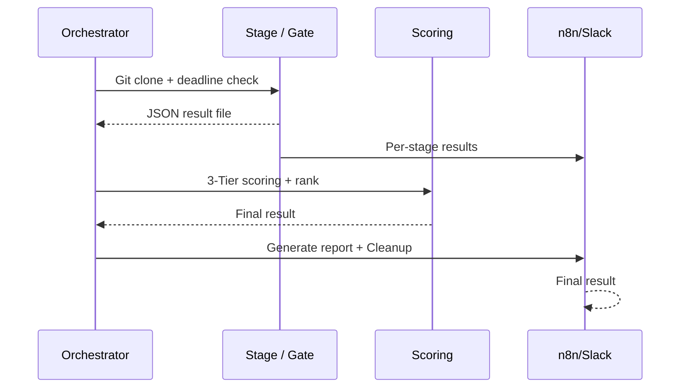
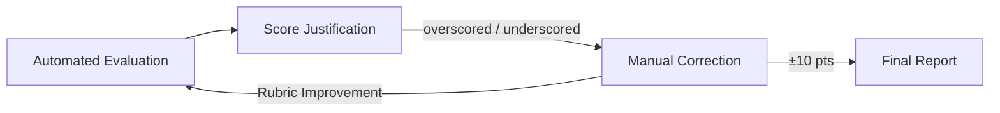
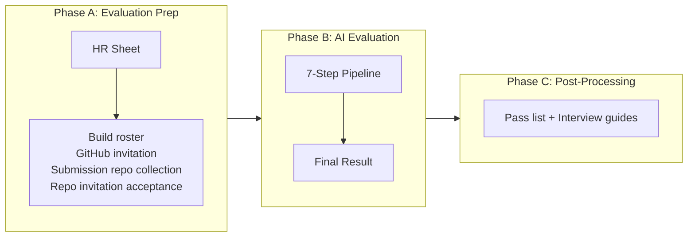

> 🇰🇷 [한국어 버전 읽기](/posts/2026-04-14-ai-native-hiring-part2-the-machine.ko/)

This is Part 2 of a three-part series on AI-native hiring. Part 1: [Philosophy, Rubric, and the 3-Tier Model](/posts/2026-02-24-ai-native-hiring-philosophy/) · Part 3: [The Human — Judgment Beyond the Score](/posts/2026-04-14-ai-native-hiring-part3-the-human/)

Written by [Myunghoon Lee](https://medium.com/@mh.lee_16701) (Musinsa Core Engineering). Edited by Tao Kim.

In Part 1, I laid out the philosophy. Ambiguity is the test. We're not looking for people who arrived at the right answer — we're looking for people who understood the question. I also introduced the 3-Tier model: **Make it Work**, **Basic Features**, **Deep Thought**.

Putting that philosophy into practice meant actually reading, building, testing, scoring, and ranking 400+ submissions. At two hours per candidate, that's 800 hours — five months of full-time work for one person.

**This post is the story of building that machine, running it, and hardening it through iteration.** Of designing a harness to direct the agent's capabilities, then watching the results and tightening that harness pass after pass.

The problem was a university course registration system. On the surface, a CRUD app. But one line made it bite: *"Even if 100 people simultaneously apply for a course with 1 seat remaining, exactly 1 must succeed."* The assignment presumed candidates would use an AI coding agent — and we evaluated not just the code but the collaboration itself.

> Shout-out to the OpenAI team and Codex — thanks for the tokens. Equal footing for every candidate.


---

# Chapter 1: Building the Machine

## Going Multi-Agent

### Not a Coding Assistant — a Process Executor

Here's everything one evaluation needs to do:

1. Git clone → check commit deadline → checkout the last pre-deadline commit
2. Scan the source for security issues
3. Validate project format
4. Read all the code and score across 8 dimensions (AI judgment)
5. Docker build → start the server → run test cases
6. Compute the 3-Tier score → assign a rank
7. Update state → Slack notification → Docker cleanup → persist results

Repeat that 400 times.

At first glance, only step 4 needs AI. That's backwards. Step 4 *obviously* needs AI — the real requirement is that the other six run autonomously under AI control.

The first instinct was "let's just build it." Write the evaluation pipeline from scratch in Python or TypeScript. But the team was small, and the hiring timeline wasn't going to wait. Git clone, security scanning, Docker builds, API testing, score calculation, external system integration — writing and verifying all of that from the ground up is a project unto itself.

A terminal-based AI agent is already a general-purpose executor. Sure, it reads and judges code — but it also runs shell commands, manipulates the filesystem, and controls Docker. Coding assistants like Cursor or GitHub Copilot can read code but can't autonomously build Docker images, manage ports, run shell scripts, or call external APIs. We didn't need a coding assistant. We needed a general-purpose agent.

Instead of writing code, we'd tell an agent that can already do all of this *what to do*. The agent provides the capability; we design the direction it points. What we actually had to build wasn't the agent — it was the harness that drives it. Instructions the agent follows, rubrics it scores against, output schemas it fills in. Those were the components.

---

## From Prompt to Playbook

"Evaluate this code for me." That works. The AI evaluates, returns the result. Next candidate? Start over. Every time, the standard drifts a little, the output format shifts a little, the depth wobbles. That's fine for one candidate. For 400, it's unworkable.

Does a written playbook fix it? Halfway. The biggest shift from ad-hoc LLM usage is **reproducibility**. Same instruction file, same criteria across all 400. Outputs are constrained by JSON Schema, persisted to files and the database.

But a more serious problem remains: **the multi-agent architecture**. What happens when one agent scores all 400 submissions in sequence? Context contamination. The 50th scoring pass still carries the residue of candidate 49. Humans make that mistake too. So do AIs. The fix is to spawn an independent agent per candidate, each working in a clean context.

An orchestrator agent iterates through the candidate list, spawning a fresh sub-agent for each one. Think of an exam room with dividers — each agent grading in its own booth. The sub-agent runs the evaluation in its own clean context, returns a result, and vanishes. Context isolation and evaluation isolation at the same time.

---

## The 7-Step Pipeline

One candidate's evaluation moves through seven steps. Before the pipeline even begins, there's a submission phase: the candidate creates a private GitHub repo, invites the Musinsa evaluation account as a collaborator, the invitation is auto-accepted, the repo state is checked, and the URL lands in the database. That's the input.

The steps come in two flavors. **Stages** handle setup, aggregation, and output. **Gates** are the filter points — the places where candidates actually get screened out. Since the whole pipeline exists to screen, we put "Gate" in the name of the four steps where screening actually happens.



**Init Stage** clones the registered repo and checks out the last commit before the deadline, freezing that snapshot of the code. Commit timestamps are forgeable, so the deadline check uses GitHub's server-side push timestamp. No push before the deadline, no submission.

**Security Gate** is the security scan. OS command execution, network calls, hardcoded secrets. First line of defense for the evaluation environment — fail here and you're out.

**Preflight Gate** is a pre-evaluation sanity check. Is there a README? A source directory? A valid build config? The question is: *can this project even be evaluated?* If not, stop here.

**Quality Gate** is where the AI reads the code and scores depth of thinking across eight dimensions.

**Functional Gate** actually boots the server inside a Docker container and runs test cases to verify behavior.

**Scoring Stage** combines these two axes through the 3-Tier model to produce the final score and assign one of seven ranks.

**Report Stage** updates dashboards, sends Slack notifications, and cleans up Docker resources.

The key is that each step does two things at once: it writes a local result JSON file (the basis for re-runs), and it updates external state (the basis for dashboards and statistics). Thanks to this dual record, we could change the scoring model without losing the per-stage raw results — just regenerate the final report. That design is what made 26 full resets survivable.

---

## Markdown as Code

This pipeline is implemented in Markdown.

Building a program in Markdown? Not a metaphor. Literally. "How do we build Docker, what order do the test cases run in, how do we compute the score" — all of it defined in Markdown files. The AI agent reads those documents and executes them. The Markdown *is* the program.

Each step's playbook is independent. Rerun just the Quality Gate. Recompute just the Scoring Stage. If the logic changes, edit the playbook, git push, done. No compilation. No deployment.

The harness had to be fast to edit. Candidates came in stronger than expected, so we kept refining the rubric to get enough signal between them. No room to modify code, run tests, and redeploy on every adjustment. Markdown playbooks take effect the moment they're saved.

The cycle had to be fast: look at results, fix the rubric, run again. This is what people are starting to call *harness engineering* — the work isn't building the agent, it's designing and iteratively tuning the instructions the agent follows. You don't fix the code. You fix the harness, and the code regenerates. Markdown made that speed possible.

Markdown's flexibility has a cost: AI output that doesn't follow the expected shape. Seven JSON Schemas enforce a structural contract on every stage's output. Strict mode (`additionalProperties: false`) validates the output, and if it fails, the error goes back to the agent for correction — up to five retries. Markdown's freedom paired with JSON Schema's rigor. That combination is the skeleton of the harness.

---

## Measuring Depth of Thought — Quality Gate

A three-hour assignment. Core requirements: CRUD for course registration plus concurrency control. Then you open the submissions and find candidates who built multi-layer caching (L1 local + L2 Redis), wired up JWT auth and RBAC, added distributed tracing via OpenTelemetry, even went into DDD tactical patterns. Not one or two — a steady stream. That's the raw implementation power of AI coding agents.

Which makes evaluation harder. "Did they implement course registration?" Most pass. The differentiation lives beyond that. And as the volume of AI-generated code grows, telling "this person understood what they built" apart from "this person submitted what the AI made" gets harder, not easier.

Isn't working output enough? If the AI agent builds it well, and it compiles and passes tests, isn't that the whole story?

If you're only looking at the code, yes. But we're not hiring code, we're hiring people. Whether the thinking behind working code is deep or shallow, whether they wrote with understanding or just let the AI handle it — you can't tell from the output alone. You have to look past it. That's what Quality Gate does.

The AI reads the candidate's code, documentation, and prompts, then scores quality across eight dimensions. Since the assignment presumes AI-agent-assisted implementation, code quality *and* how the candidate wielded the AI are both part of the evaluation.

| Dimension | Points | What we evaluate |
|-----------|--------|------------------|
| Prompts | 18 | The thinking inside the AI collaboration — depth of insight, exploration of ambiguity, quality of debate |
| Agent Instructions | 17 | How well the candidate communicated project context to their AI |
| Requirement Derivation | 18 | Did they restructure the assignment's requirements in their own words? |
| Data Design | 17 | ERD, normalization, indexing strategy |
| Code Quality | 19 | Architecture, concurrency control, error handling |
| Tests | 10 | Coverage and whether concurrency tests were included |
| Git History | 5 | Did they work in meaningful commit units? |
| Additional Implementation | 10 | Caching, monitoring, API documentation — beyond the base requirements |

Prompts and Agent Instructions together are 35 points. Neither dimension exists in a traditional coding test. Traditional code review doesn't examine how the engineer talked to their tools. But when the tool is an AI agent, the quality of that conversation *is* part of the engineering. What you asked the AI to do matters as much as what it produced.

That's the initial weighting. How it shifted in practice is Chapter 2.

### A Score Without Evidence Isn't a Score

When the AI scores, it must cite code evidence (file:line). "Error handling is solid" is not a score. "`src/handler/GlobalExceptionHandler.java:15` — `@ControllerAdvice`-based global exception handler" — that's a score.

The principle was there from day one. But there's always a gap between principle and execution. Before the real evaluation, internal engineers volunteered to solve the same assignment — thank you again for showing up on short notice — and we used their submissions to validate the pipeline. Rubrics that behaved fine in internal testing started misbehaving when the AI met 400 candidates' worth of variety. "Looks good" assertions with no evidence started slipping through. Without evidence, you can't verify. Without verification, you can't trust.

We hardened the rubric. Hundreds of results already existed, but we refined the scoring items and — for trust's sake — reset everything and ran it again from scratch.

---

## Functional Testing in the Trenches — Functional Gate

There's a reason I started with Quality Gate. Reading and scoring code is relatively fast and simple. Actually running the code — spinning up a Docker container, booting the server, firing test cases — looks simpler from the outside and is harder in practice. Functional Gate handles the hard side: *does this code actually work?*

There's a concept in programming called **duck typing**. Walks like a duck, quacks like a duck, call it a duck. Functional Gate runs on the same principle. If it responds like a working system, it is a working system. We don't ask how it got there.

### Every Candidate Has a Different API

The hardest part here: every candidate ships a different API.

We deliberately didn't specify endpoints. We just said "document it like an open-source project." That's the Part 1 principle of *ambiguity is the test* in action. Total ambiguity would make evaluation impossible, though. Automating evaluation across hundreds of submissions needed *some* common structure, and open-source documentation conventions (README, API spec) were the minimal hint we could get away with. The technical consequence of that decision looks like this:

- Candidate A: `POST /enrollments`, body with studentId/courseId
- Candidate B: `POST /api/v1/enrollments`, body with student_id/course_id
- Candidate C: `POST /courses/{id}/enroll`, X-Student-Id header

The same "enroll in a course" feature, in dozens of shapes. Classic automated testing against fixed endpoints is impossible.

So the AI agent reads each candidate's docs and source and maps features to actual endpoints. Static analysis searches for framework-specific patterns (`@PostMapping`, `app.post()`, `@app.post()`), then when the Docker container is up, it sends real requests to the detected endpoints to verify they respond, and maps the verified endpoints to test cases.

Detection is needed *because* we didn't specify endpoints. Well-documented submissions map fast. Poorly-documented ones force the agent to dig through framework patterns, source structure, and build configs. Giving whoever runs your code — agent or human — enough context is a good-engineer habit. **Good docs equal testability.** (Bad docs also burn more of the agent's tokens. We briefly considered making that a scoring deduction.)

### Laddered Partial Credit

Test cases aren't simple pass/fail. Within a single TC, we hand out integer scores based on implementation quality.

Take the concurrency test: fire 50 concurrent requests, verify that exactly one succeeds, repeat three times. Three for three exact: 10 points. Two for three: 8. One for three: 6. No over-capacity but inconsistent: 4. Over-capacity on some runs: 2. No concurrency control at all: 0.

"Mostly works, occasionally fails" earns partial credit. Someone who gets concurrency right 2 out of 3 times is a very different story from someone with no concurrency control at all.


### A Failed Build Doesn't End the Story

When a build fails, most TCs can't run. But *why* it failed matters. "Build failed because npm version didn't match" and "build failed because there's no code" are completely different stories. The first is probably fine once the environment is right. To cut the ~15% build failure rate, we prepared 15 Dockerfile templates. Templates cover Java (Gradle/Maven), Node.js (npm/yarn), and Python (pip/poetry) across combinations — but we never touched the candidate's source code. Docker infra, modifiable. Source, off-limits.

### When the Build Works But the App Doesn't Run

We deliberately didn't require Dockerization. Candidates who thought about runtime testability all the way through got more points for it.

That decision made for an interesting problem. Some candidates quietly assumed MySQL 5.x without documenting it. The evaluation agent frequently wired up MySQL 8, and the build succeeded but the app failed at runtime. A query pattern wasn't supported, or default settings didn't line up so the connection failed outright.

Was it right to fail a candidate with clear depth of thinking over an environment mismatch? We reviewed individually and — without touching their source — nudged the runtime environment enough to rescue them. That's the complexity you accept when you choose not to specify.

Even when build or runtime fails, Quality Gate (the AI code review) still runs. Not being able to execute the code doesn't mean you can't read it. Functionality can't be verified, but depth of thinking still can.

---

## The Scoring Model Evolves

### From Pass/Fail to 3-Tier

The scoring model was designed up front and validated with internal testing before we started. The real 400 submissions were nothing like the internal test. Look at results, find problems, fix the model, run again. It was closer to tuning a reward function than shipping a spec.

We started simple. **The Pass/Fail era.** TC runs, passes or fails. The limit showed up fast. Someone who nailed concurrency and someone who barely cleared basic CRUD — same "pass"? No.

So we moved to **letter grades**. S/A/B/C/D/F by score range. Better, but a new problem: refining any scoring item shook up the grades. Summing functional score and code-quality score flat meant "weak functionality but exceptional design" and "perfect functionality but shoddy code" landed in the same bucket.

Eventually we arrived at the **3-Tier model**. This is where the critical split happened: evaluate functional behavior and depth of thought *independently*.

Base comes from Functional Gate — the score from running TCs in Docker. *Does the code work?* Depth comes from Quality Gate — the AI's score across 8 dimensions after reading the code and docs. *Does the candidate understand the code?* These two are scored independently.

Why insist on this separation? Because we had candidates whose build failed (Base = 0) but whose code design was exceptional. And we had candidates whose app ran perfectly but, on inspection, had clearly submitted AI-generated code they barely understood. Evaluate both with the same yardstick and both get mis-evaluated. **That's why Base and Depth are split.**

### Seven Ranks

Add Base and Depth and you get a total. Sort by total and you have a ranking. Simple. But two candidates with the same total — one high on Base and low on Depth, one the reverse — are fundamentally different hires. The *shape* of the score was the hiring signal, not the magnitude. Different shapes need different judgment.


**Ace** — high on both functional score and code quality.

**Craftsman** — functional score as high as Ace, code quality somewhere in the middle or above.

**Hustler** is the most interesting rank. Functionality works perfectly. All TCs pass. But Depth is low. This is where the call gets hard. It could be the result of genuinely deep thinking that nailed the requirements. It could also be AI-generated code that happened to run cleanly. The machine can detect the pattern, but not which side it came from. Interview outcomes varied most dramatically for this rank.

**Thinker** is the mirror image. The build failed, but code quality clears the bar. Someone with thin DevOps chops but strong thinking. Is it right to zero someone out when the only thing that failed was the build? The Thinker rank was born from that question.

Hustler and Thinker. Perfect functionality with shallow thinking, versus stumbling execution with deep thinking. Distinguishing those two is the real reason Base and Depth are separate.

**Contender** — upper-middle on functional score. **Rookie** — middle on functional score; needs extra verification. **Incomplete** — everything else, below the bar.

---

Seven-step pipeline, 3-Tier scoring, seven ranks. That's the harness design.

But design isn't enough. You only know the harness by running it. Results fix the rubric, and the fixed rubric changes the next run. AI scoring is the tip of the iceberg. Underneath sits the weight of this iteration.

---

# Chapter 2: Running the Machine

## The Rubric Evolves

Chapter 1 showed you the initial weights. Eight dimensions, 10-19 points each, fairly even distribution. Not bad in a short internal test.

Running it against 400+ real candidates changed the picture.

More candidates than expected shipped fully working code. "It runs" by itself didn't separate anyone.

The input side was even worse. Prompts and Agent Instructions were supposed to look at the *input* — not just the output code but the conversation with the AI. But prompt submission was voluntary, not system-enforced. Shapes varied wildly, and a lot of them were already AI-touched-up summaries. The distribution was closer to "submitted or didn't" than a continuous spectrum. No middle ground means no signal.

Neither the output (base features) nor the input (the AI conversation) was generating differentiation. What was left was the spectrum of the implementation itself.

Look at the submissions and the range of work *past* the base requirements varied enormously. Some candidates added caching. Some added caching + auth. Some added caching + auth + monitoring + distributed tracing + DDD.

CQRS, event sourcing, circuit breakers — we stretched the rubric to imagine as many plausible directions as we could. We split "additional implementation" into eight sub-sections (auth, caching, infrastructure, DB design, advanced API design, observability, architecture, business extensions) and evaluated each across three dimensions (implementation, quality, documentation). The points ceiling went from 10 to 45.

But we added a cap. The sum across all eight sub-sections could mathematically reach 80, but we capped it at 45. The goal: prevent "built a lot" from becoming its own reward. We kept seeing the AI catch sight of a single `@Cacheable` annotation and happily award "caching strategy implemented." In practice, there was often no TTL strategy, no invalidation logic. Caching *existing* isn't a score — integration quality and documentation have to be there too. The cap is a device that converts quantity into quality.

Early on, the AI's scores for the same candidate drifted by ±6-11 points across sessions. After we added evidence checklists to the rubric (what signals to look for in each area, what form the evidence should take), drift dropped to ±3. Is ±3 still shaky? Maybe. Think about a human scoring 400 submissions in open-response format — would they be more consistent? The same person grades differently in the morning and afternoon. Different graders, even more so.

Through all of this, the total grew to a 220-point system: 100 for Base, 120 for Depth. The center of gravity is still *it works*. Candidates whose code runs outscore candidates whose code doesn't — that principle never moved. Of the 120 Depth points, 45 are headroom for candidates who went past what we asked for. Not many candidates scored high in that range. It was a top-end differentiator.

### A Three-Layer Feedback Loop

Calibration happened in three steps.



**Step 1: Automated Evaluation.** Quality Gate and Functional Gate produce scores.

**Step 2: Pattern Detection.** After evaluation, a separate AI agent re-reads the code, hunting for gaps between the score and the actual code. If "error handling: 2 pts — uses `@ControllerAdvice`" is the assessment but there's no `@ControllerAdvice` in the code, flag it as *overscored*. If the build failed (Base = 0) but tracing the code path shows the logic is actually correct, flag it as *underscored*. Stack those flags up and you stop seeing individual score errors — you start seeing systematic bias in specific areas.

**Step 3: Rubric Improvement.** A human reviews the flags. But the fix isn't correcting individual scores — it's fixing the rubric. Add a calibration hint like "for Additional Implementation, score integration quality, not mere presence." On the next run, the same bias shrinks.

The human's role isn't validating individual scores. That becomes a bottleneck. The human is the calibration signal — spotting structural patterns the system can't see and feeding them back into the rubric. Fixing the scoring *criteria* for 400, not the score for one.

Of course there are individual corrections for exceptional cases (-10 to +10 per item), with reasons logged as structured JSON. But that's a byproduct of the loop, not its purpose.


---

## Scale and Infrastructure

"AI grading system." That's what it looks like from the outside. Only half true. What it actually is: a system that automates the entire hiring process — AI grading is just one step.

Build the candidate roster → GitHub invitation → collect submissions → track evaluation state → sync scores → build the pass list → invite interviewers. A workflow automation tool (n8n) runs through the whole process.



The AI evaluation this post is about is one step in the larger process. Without the prep step, evaluation can't even start. Without the post-processing step, evaluation results never turn into hiring decisions. 20+ workflows move data between Google Sheets, PostgreSQL, and the GitHub API. HR adds a candidate to the sheet and the rest runs itself.

This infrastructure didn't exist on day one. In early internal testing, we had dozens of candidates and ran them sequentially on one machine. Plenty. In front of 400+, not even close.

Two machines can't evaluate the same candidate. Roster changes and re-invitations happen constantly. Overall progress has to be visible in real time. The evaluation pipeline alone wasn't enough — it needed operational infrastructure around it. Only after n8n workflows, PostgreSQL-based state management, and a Grafana dashboard for tracking were in place could we actually start the main run.


Automating evaluation at this scale needs an orchestrator that repeatedly invokes the "evaluate one candidate" logic. This, too, is written in Markdown.

```text
FOR candidate_id IN eligible:
  IF evaluation result already exists: SKIP

  TRY:
    result = Task(
      subagent_type: "general-purpose",
      prompt: "/project:evaluate-candidate {candidate_id}",
      description: "Evaluate: {candidate_id}"
    )
    completed++

  CATCH:
    errors.append(candidate_id)
```

Not Python. Not shell. Pseudocode written so the AI can read it and grasp the intent. The agent reads this pseudocode and actually spawns sub-agents to execute it.

Why not just run everyone in parallel? The constraint is safety, not performance. Functional Gate uses Docker and runs sequentially — container port collisions and memory contention. Quality Gate (AI code review) also runs sequentially — context isolation is required. Lighter work that doesn't touch Docker (final scoring, report generation) runs 5-way parallel. And we could distribute candidates across multiple machines to run in parallel at that level.

---

## What the Numbers Say

| Metric | Value |
|--------|-------|
| Development period | 36 days |
| Total commits | 1,952 |
| Contributors | 3 |
| Candidates evaluated | 400+ |
| Scoring-model changes | 17 |
| Result resets | 26 |
| Pipeline instruction files | 26 |
| JSON schemas | 7 |

17 scoring-model changes, 26 resets. The footprint of the calibration loop from the previous section. Fix the rubric, reset the results, run again from the top. Not once — twenty-six times.

The most telling number: commits that *build the system* (feature work, bug fixes, refactoring) were 14.5%. Commits that *work the system* (evaluation runs, result persistence) were 59.5%. Building took 1 unit of effort. Running took 4.

Five machines ran evaluations in parallel. We rotated through 10 agent accounts, swapping when token usage got close to the ceiling. The machine from Chapter 1 was just the start.

---

## From Machine to Human

The machine can now measure Base and Depth, and the calibration loop keeps refining the rubric. But in the end, we're hiring people, not code. The score tells you who to interview. The question "do I want to build with this person?" belongs to a human.

When evaluation finishes, another AI run analyzes each passing candidate's actual code and auto-generates code-evidence-based interview questions. Not generic technical questions. Questions that start from *this person's code*. Why did they split the lock into two? What happens if you deploy this service to a distributed environment? Questions that point to specific lines and kick off a conversation there. For Hustlers, questions that verify understanding. For Thinkers, questions that verify execution. The interview shape changes with the rank.

That's the machine's final output. What happened when that guide landed in an interviewer's hands is Part 3.

---

## Looking Back

There were far more commits working the system than building it. Running took four times the effort of building. First get it running, run internal tests to find problems, build up state management, do a full overhaul, go into production mode.

In hindsight, this whole thing was designing and calibrating a harness. The agent's capabilities were already there. What we did was define the direction those capabilities pointed, watch the results, correct the direction, and run again. Tighten the harness, run it, tighten it again.

The funny part: the process itself mirrors the virtues the system evaluates. Make it Work → Basic Features → Deep Thought. Get it running, get the basics right, then add depth. Turns out the system we built and the code it evaluated were walking the same path.

In Part 1, I said we're not just looking for people who arrived at the right answer — we're looking for people who understood the question.

Building and running this machine, we had the same experience. There are things the score doesn't say. Signals the AI can't read. Depth that doesn't convert into points. However tightly you tune the harness, there are moments that demand human judgment. When we actually met candidates sorted by this rank system in interviews, patterns showed up that we hadn't anticipated.

We aren't hiring AIs directly, after all. Not yet.

---

*Part 2 of a three-part series on AI-native hiring. Next: "The Human — Judgment Beyond the Score."*
